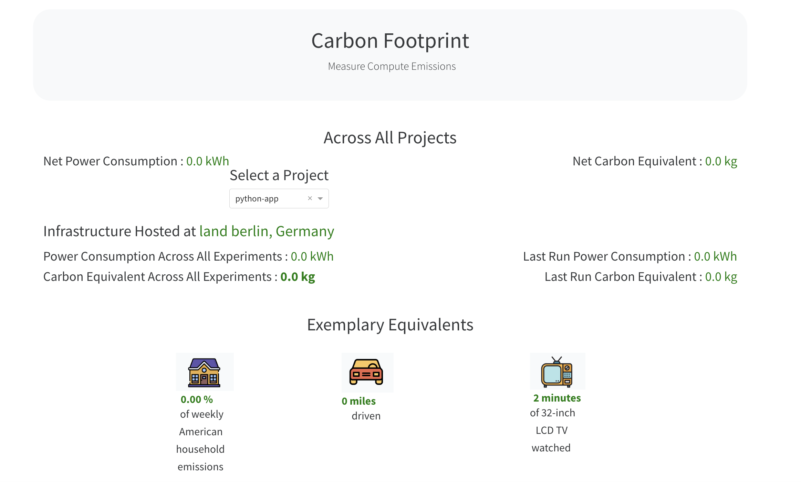

# Monitoring carbon emissions: making the impact of your python code visible 🏭 📈

*“If the Internet was a country, it would be the 4th largest polluter”*  [[1](https://www.sustainablewebmanifesto.com/#citation)] The power to make impactful change through technology has never been greater. Doing so starts with understanding the problem space. Our workshop will guide you through the process of quantifying the emissions of your Python code and integrating this awareness into your monitoring strategy.

Starting with the basics of observability, an essential part of operating a deployed service, you’ll learn why it’s important to monitor your Python code, what makes a good metric, and the common pitfalls to avoid. We’ll then dive into the practical aspects of exposing and creating custom metrics, scraping and storing them in Prometheus, a time series database, and then visualising them in dashboards using Grafana.

The workshop will also include an overview of climate-conscious tech, discussing the tech industry’s contribution to the climate crisis and introducing the principles of green coding. We’ll explore techniques and libraries for extracting metrics for carbon awareness, because "If you can't measure it, you can't improve it." (Peter Drucker) and guide attendees through a practical session on instrumenting your Python code for carbon emissions and visualizing this data.

By attending this workshop, you’ll gain valuable insights and hands-on experience in making your code more carbon-conscious. You’ll learn about carbon-aware workloads, strategies for making your services more energy, and carbon efficient, the importance of cloud provider regions and transparency, and how to advocate for change. These skills and knowledge can be integrated into your day-to-day work, making a real difference in our world.

Join us in this journey towards a more sustainable future in tech and a better planet for everyone.

This workshop has been developed for PyCon US 2024 by @Simpcyclassy and @sleepypioneer. It is developed on top of iterations of this material by @Vinesse, @emilywoods, which was originally developed by @jasongwartz and @sleepypioneer.

---
### Objective

In the directory `app/`, we have an application that runs a Python web server with the endpoint `/carbon_intensity`. It displays the total carbon intensity for a given zone. We want to start observing the behavior of this application at runtime by tracking and exporting metric data.

We will do this using the time-series database system [Prometheus](https://prometheus.io), which uses a "pull" method to extract data from running applications. This means that the applications need to "export" their data, so that Prometheus is able to "scrape" the metric data from them. This is typically done via an HTTP endpoint (`/metrics`, by convention).

We will use the [Prometheus Python client library](https://github.com/prometheus/client_python) to track metrics in our code.

### Agenda

* [Introduction: What is Monitoring and Why is it important?]()
* [Using this repository & prerequisites]()
* [Section 1: Exposing metrics](#section-1:-exposing-metrics)
  * [Challenge 1: Expose base app metrics on /metrics endpoint]()
* [Section 2: Creating custom metrics](#section-2:-creating-custom-metrics)
  * [Challenge 2: Expose base app metrics on /metrics endpoint]()
* [Section 3: Inspecting metrics with Prometheus & Grafana](#section-3:-scraping-metrics-with-prometheus-and-creating-dashboards-with-grafana)
  * [Challenge 3: Query your metric with PromQL]()
    * [Challenge 4: Create a Grafana Dashboard]()
* [Section 4: Carbon Conscionsious Development](#section-4:-measuring-carbon-emissions-for-our-application)
  * [Challenge 5: Measure carbon emissions for our application]()
  * [Challenge 6: Adding our carbon metrics to our Grafana Dashboard]()
* [Bonus Material: Histograms in Prometheus](#bonus-material:-histograms-in-prometheus)
* [Troubleshooting](#troubleshooting)

### Prerequisites

For this workshop you will need [Python 3.11](https://installpython3.com/), [Poetry](https://python-poetry.org/docs/#installation), [Docker](https://docs.docker.com/get-docker/) and [Docker Compose](https://docs.docker.com/compose/install/) running on your machine. *(on mac os docker-compose is by default installed with Docker)*

You will also need a free API key for Electricity Map, which you can get by signing up [here](https://api-portal.electricitymaps.com/). This key will be used to get the carbon intensity data for a given zone.


Please note that this repository is linted and formatted using [ruff](https://pypi.org/project/black/) with a max line length of 100. This linting is enforced with github actions configured [here](./github/workflow/lint.yml)

## Workshop Content

---

🛑 Before you begin you will need to save your API key in a `.env` file in the root of the project. The file should look like this:

```sh

ELECTRICITY_MAP_API_KEY=your-api-key

```


### Section 1: Exposing metrics ⚙️

---

For this section, you can use the following command to install dependencies and run the dev server locally.

```sh
# The Makefile allows us to run commands behind a target name
# Make is not available for the Windows OS so you will need to copy the commands from the Makefile and run them directly ie `cd app && poetry run python main.py`
make dev
```

This command will start a python server which will have the endpoint `/carbon_intensity` available for the hard coded zone (you can change this in the code if you like). The server will be running on `localhost:8001/carbon_intensity` and display the current carbon intensity for that zone.

To export our metrics we will need to have a server with a handler to *handle* the metrics. We can do this by changing the base class of our HTTPRequestHandler to the `MetricsHandler` provided by the prometheus python client. We also need to add the condition for the `/metrics` endpoint below our `/carbon_intensity` endpoint condition. *(Don't forget to import the `MetricsHandler` from the `prometheus_client`)*

``` python
class HTTPRequestHandler(MetricsHandler):
    ...
    ...
    elif endpoint == '/metrics':
        return super(HTTPRequestHandler, self).do_GET()
```

Now try restarting the server (`control c` will stop it) and go to `localhost:8001/metrics`. What do you see? What do you see if you visit `localhost:8001/carbon_intensity` a few times and then go back to the `/metrics` endpoint? What do these base metrics represent?

---

### Section 2: Creating custom metrics 🔧

---

Now that we can expose metrics, we need to create them. Prometheus has a few different data types but the most straight forward is a `Counter`. Counters always increment and can be used to track, for example, the number of requests received (you can then divide this unit over time to calculate requests per second). To create a `Counter`, import it from the Prometheus Python client and instantiate it.

``` python
from prometheus_client import Counter
requestCounter = Counter('requests_total', 'total number of requests', ['status', 'endpoint']) # can be declared as a global variable
```

Restart your server again and you should be able to see your metric exposed on `/metrics` - success! (Except, it will still always report 0 - not quite useful, yet)

```
# HELP requests_total Total requests
# TYPE requests_total counter
requests_total{} 0

```

To use our metric in practice, we want to increment the counter when tracking events in our code. To increment the `Counter` type by one, we can call `.inc()` - for example, using the request counter we created above, we could call:

``` python
requestCounter.labels(status='200', endpoint='/carbon_intensity').inc()
```

**You should add these `.inc()` calls in the place in your code where the event you want to track is occurring.** If you want to increment by a different amount than 1, you can for example, use `.inc(1.5)`.

Add the call to `inc()` in your code. Try experiment with the placement of where you call it, what difference does it make to your metric?


#### Already finished?

How about creating a custom metric to measure the latency of your requests? You might consider a histogram for this as it splits the latency into buckets. You'll find some more information on histograms in the [bonus material](#bonus-material:-histograms-in-prometheus) at the bottom of this page.


---

### Section 3: Scraping Metrics with Prometheus and creating Dashboards with Grafana 🔥📈

---

So far we've been able to instrument our application, such that it is now exporting metrics about its runtime behavior. However, we still need to collect those metrics and store the data in a way so we can query it back out in order to graph it over time and make dashboards.

There is a `prometheus.yaml` configuration file here in the repo, which is already set up to scrape metrics from our application. We will run our application, Prometheus, and Grafana inside Docker, so that they are easily able to find each other.

#### Run the application, Prometheus and Grafana in Docker

To build the application Docker image and start the application container as well as Prometheus and Grafana together, run the following command (from the root of this repo):

``` sh
docker-compose up --build
```

*If you see errors it may be because you still have the previous version of the application running and therefore might be using the same port as you are now trying to access with Docker.*

You should then be able to access the Prometheus dashboard on `http://localhost:9090`

#### Navigating the Prometheus UI and using PromQL to query metrics

Prometheus should find and immediately start scraping metrics from the application container. You can check that it's found the application container by looking at the list of "targets" that Prometheus is scraping `http://localhost:9090/targets`

Prometheus uses it's own query language called [PromQL](https://prometheus.io/docs/prometheus/latest/querying/basics/). You can enter PromQL queries in the `/graph` page of the Prometheus UI.

To see the counter exported previously, we can use the PromQL query:

``` promql
requests_total
```

If we want to see this graphed as a rate per-second over time, we use the PromQL query:

``` promql
rate(requests_total[1m])
```

#### Making Dashboards with Grafana 

[Grafana](http://grafana.com) is an open-source metric visualization tool, which can be used to create dashboards containing many graphs. Grafana can visualize data from multiple sources, including Prometheus. The `docker-compose` command used in the previous section will also start a Grafana container, which uses the Grafana configuration file in this repo to connect to Prometheus. After running the startup command mentioned above, `docker-compose up --build`), you'll be able to find Grafana on `http://localhost:3000`

Grafana uses authentication, which, for this workshop, is configured in the `docker-compose.yaml` file. The credentials configured for this workshop are:

```
username: pycon2024
password: workshop
```

Time to get creative and visualize your metrics in a meaningful way so you can observe your application and even set up alerts for any behavior you want to be informed about! We will show you in the workshop how to build a simple dashboard panel but there's lots to explore. Lots of useful information can be found on both the [Prometheus](https://prometheus.io) and [Grafana](http://grafana.com) websites.
</s>
### Section 4: Carbon Conscientious Development 🌍
#### Why

The tech industry is responsible for a significant portion of global carbon emissions. By measuring the carbon emissions of our applications, we can make informed decisions about how to reduce our carbon footprint. This is important for both the environment and for the sustainability of our industry, however, there is often other benefits associated with these changes such as cost savings and performance improvements. As carbon conscientious  developers the first step is knowing the current state of affairs, this where carbon metrics come in.

We will be using the Python library from [Codecarbon](https://codecarbon.io/) to instrument our code just as we have done above and pass out the metrics to Prometheus so we can extend our Dashboards in Grafana to include carbon emissions.


#### Codecarbon Quickstart

```sh
# In a new terminal window from the root of the repository
# Make sure the app is not already running elsewhere!!
make dev

# In a new terminal window from the root of the repository
make codecarbon-init
# This will write an experiment id into the .codecarbon.config at the root level of the repository
make codecarbon-monitor
# You may have to put in your computer's password to allow codecarbon to access your machine's hardware
```

##### Codecarbon Output

You will start to see metrics from your machine.

```sh
[codecarbon DEBUG @ 20:34:14] _get_power_from_cpus - DONT MATCH CPU Power : 0.5262
[codecarbon DEBUG @ 20:34:14] _get_power_from_cpus - DONT MATCH CPU Energy Delta : 0.5262
[codecarbon DEBUG @ 20:34:14] _get_power_from_cpus - MATCH GPU Power : 0.0131
[codecarbon DEBUG @ 20:34:14] _get_power_from_cpus - DONT MATCH GPU Energy Delta : 0.0131
[codecarbon DEBUG @ 20:34:14] AppleSiliconChip : 0.01 W during 6.75 s [measurement time: 1.6425]
[codecarbon INFO @ 20:34:14] 0.000144 kWh of electricity used since the beginning.
[codecarbon DEBUG @ 20:34:14] last_duration=3.4494149684906006
```


#### How to measure specific parts of our code

If we want to know more about our specific application, and specific operations within it, we can use the `codecarbon` library to instrument our application.

First we need to import the track_emissions from the codecarbon library and call it as a decorator for our `fetch_carbon_intensity()` function.

``` python
from codecarbon import track_emissions

@track_emissions()
    def fetch_carbon_intensity():
```

Now let's start everything running again (make sure you have **stopped** it first!)

```sh
# In a new terminal window from the root of the repository
# Make sure the app is not already running elsewhere!!
make dev

# Now visit your app's page, if it will not load, you need to go back to the terminal and enter your password to allow codecarbon to track your machines hardware
```

Refresh the page a couple of times, you will see the logs for your metrics and a new file `emissions.csv`has been created.

##### Visualising our metrics with Codecarbon

In a new terminal run the following:

```sh
make codecarbon-report
```

Then open [http://127.0.0.1:3333/](http://127.0.0.1:3333/) in your browser to see the Codecarbon dashboard. Note that the dashboard will not update and only contain the metrics up until when you ran the command.



You will see that our application produces such a small amount currently that it doesn't register much on this dashboard. However, as you scale your application and add more features, you will see this number increase. This is a great way to keep track of the impact of your code on the environment and also see how it compares to other emission activities.


#### Passing our metrics to Prometheus so we can visualise them in Grafana

To have a more complete view of our application, we can pass the metrics to Prometheus and add them to our dashboard (or start a new one) in Grafana.

First stop the app if it is running and update your tracker:

```
tracker = EmissionsTracker(
    project_name="python-app",
    save_to_prometheus=True,
    prometheus_url="http://pushgateway:9091",
)
```

We will need to run the app via `docker-compose up --build` this will also run our instance of Prometheus, Grafana and in addition a Prometheus Gateway.

First go to your app's endpoint in the browser and run it a few times so that you generate metrics.

Next go to Grafana at [http://localhost:3000/](http://localhost:3000/) and go to the explore tab. Here you can write a query to see your metrics. For example, you can write `codecarbon_` to see the autocomplete options for the metrics from your app.

Finally, you can add these metrics to your dashboard by clicking the `+` button and selecting `Add Panel` and then `Add Query`. Here you can write your query and then click `Apply` to see your metrics on your dashboard. Try the query below to see your emissions being charted, go back to your application endpoint and run it again a few more times, then refresh the dashboard to see the change.

```
avg(rate(codecarbon_emissions[$__range])) by (project_name)
```


###### Prometheus Gateway

The Prometheus Gateway is a separate service that is used to collect metrics from multiple sources and then push them to Prometheus. This is useful when you have multiple services running and you want to collect metrics from all of them in one place. It is also useful when the application you are running doesn't have a server for which you can run Prometheus for (such as cron jobs or in our case the tracker)


### Section 4: Carbon Conscientious Development 🌍
#### Why

The tech industry is responsible for a significant portion of global carbon emissions. By measuring the carbon emissions of our applications, we can make informed decisions about how to reduce our carbon footprint. This is important for both the environment and for the sustainability of our industry, however, there is often other benefits associated with these changes such as cost savings and performance improvements. As carbon conscientious  developers the first step is knowing the current state of affairs, this where carbon metrics come in.

We will be using the Python library from [Codecarbon](https://codecarbon.io/) to instrument our code just as we have done above and pass out the metrics to Prometheus so we can extend our Dashboards in Grafana to include carbon emissions.


#### Codecarbon Quickstart

```sh
# In a new terminal window from the root of the repository
# Make sure the app is not already running elsewhere!!
make dev

# In a new terminal window from the root of the repository
make codecarbon-init
# This will write an experiment id into the .codecarbon.config at the root level of the repository
make codecarbon-monitor
# You may have to put in your computer's password to allow codecarbon to access your machine's hardware
```

##### Codecarbon Output

You will start to see metrics from your machine.

```sh
[codecarbon DEBUG @ 20:34:14] _get_power_from_cpus - DONT MATCH CPU Power : 0.5262
[codecarbon DEBUG @ 20:34:14] _get_power_from_cpus - DONT MATCH CPU Energy Delta : 0.5262
[codecarbon DEBUG @ 20:34:14] _get_power_from_cpus - MATCH GPU Power : 0.0131
[codecarbon DEBUG @ 20:34:14] _get_power_from_cpus - DONT MATCH GPU Energy Delta : 0.0131
[codecarbon DEBUG @ 20:34:14] AppleSiliconChip : 0.01 W during 6.75 s [measurement time: 1.6425]
[codecarbon INFO @ 20:34:14] 0.000144 kWh of electricity used since the beginning.
[codecarbon DEBUG @ 20:34:14] last_duration=3.4494149684906006
```


#### How to measure specific parts of our code

If we want to know more about our specific application, and specific operations within it, we can use the `codecarbon` library to instrument our application.

First we need to import the track_emissions from the codecarbon library and call it as a decorator for our `fetch_carbon_intensity()` function.

``` python
from codecarbon import track_emissions

@track_emissions()
def fetch_carbon_intensity():
  ...
```

Now let's start everything running again (make sure you have **stopped** it first!)

```sh
# In a new terminal window from the root of the repository
# Make sure the app is not already running elsewhere!!
make dev

# Now visit your app's page, if it will not load, you need to go back to the terminal and enter your password to allow codecarbon to track your machines hardware
```

Refresh the page a couple of times, you will see the logs for your metrics and a new file `emissions.csv`has been created.

##### Visualising our metrics with Codecarbon

In a new terminal run the following:

```sh
make codecarbon-report
```

Then open [http://127.0.0.1:3333/](http://127.0.0.1:3333/) in your browser to see the Codecarbon dashboard. Note that the dashboard will not update and only contain the metrics up until when you ran the command.


You will see that our application produces such a small amount currently that it doesn't register much on this dashboard. However, as you scale your application and add more features, you will see this number increase. This is a great way to keep track of the impact of your code on the environment and also see how it compares to other emission activities.


#### Passing our metrics to Prometheus so we can visualise them in Grafana

To have a more complete view of our application, we can pass the metrics to Prometheus and add them to our dashboard (or start a new one) in Grafana.

First stop the app if it is running and update your tracker:

```
tracker = EmissionsTracker(
    project_name="python-app",
    save_to_prometheus=True,
    prometheus_url="http://pushgateway:9091",
)
```

We will need to run the app via `docker-compose up --build` this will also run our instance of Prometheus, Grafana and in addition a Prometheus Gateway.

First go to your app's endpoint in the browser and run it a few times so that you generate metrics.

Next go to Grafana at [http://localhost:3000/](http://localhost:3000/) and go to the explore tab. Here you can write a query to see your metrics. For example, you can write `codecarbon_` to see the autocomplete options for the metrics from your app.

Finally, you can add these metrics to your dashboard by clicking the `+` button and selecting `Add Panel` and then `Add Query`. Here you can write your query and then click `Apply` to see your metrics on your dashboard. Try the query below to see your emissions being charted, go back to your application endpoint and run it again a few more times, then refresh the dashboard to see the change.

```
avg(rate(codecarbon_emissions[$__range])) by (project_name)
```


###### Prometheus Gateway

The Prometheus Gateway is a separate service that is used to collect metrics from multiple sources and then push them to Prometheus. This is useful when you have multiple services running and you want to collect metrics from all of them in one place. It is also useful when the application you are running doesn't have a server for which you can run Prometheus for (such as cron jobs or in our case the tracker)


### Section 4: Measuring carbon emissions for our application

#### Why

The tech industry is responsible for a significant portion of global carbon emissions. By measuring the carbon emissions of our applications, we can make informed decisions about how to reduce our carbon footprint. This is important for both the environment and for the sustainability of our industry, however, there is often other benefits associated with these changes such as cost savings and performance improvements. As carbon conscientious  developers the first step is knowing the current state of affairs, this where carbon metrics come in.

We will be using the Python library from [Codecarbon](https://codecarbon.io/) to instrument our code just as we have done above and pass out the metrics to Prometheus so we can extend our Dashboards in Grafana to include carbon emissions.


#### Codecarbon Quickstart

```sh
# In a new terminal window from the root of the repository
# Make sure the app is not already running elsewhere!!
make dev

# In a new terminal window from the root of the repository
make codecarbon-init
# This will write an experiment id into the .codecarbon.config at the root level of the repository
make codecarbon-monitor
# You may have to put in your password to allow codecarbon to access your machine's hardware
```

##### Codecarbon Output

You will start to see metrics from your machine.

```sh
[codecarbon DEBUG @ 20:34:14] _get_power_from_cpus - DONT MATCH CPU Power : 0.5262
[codecarbon DEBUG @ 20:34:14] _get_power_from_cpus - DONT MATCH CPU Energy Delta : 0.5262
[codecarbon DEBUG @ 20:34:14] _get_power_from_cpus - MATCH GPU Power : 0.0131
[codecarbon DEBUG @ 20:34:14] _get_power_from_cpus - DONT MATCH GPU Energy Delta : 0.0131
[codecarbon DEBUG @ 20:34:14] AppleSiliconChip : 0.01 W during 6.75 s [measurement time: 1.6425]
[codecarbon INFO @ 20:34:14] 0.000144 kWh of electricity used since the beginning.
[codecarbon DEBUG @ 20:34:14] last_duration=3.4494149684906006
```


#### How to measure specific parts of our code

If we want to know more about our specific application, and specific operations within it, we can use the `codecarbon` library to instrument our application.

First we need to import the track_emissions from the codecarbon library and call it as a decorator for our `fetch_carbon_intensity()` function.

``` python
from codecarbon import track_emissions

@track_emissions()
    def fetch_carbon_intensity():
```

Now let's start everything running again (make sure you have **stopped** it first!)

```sh
# In a new terminal window from the root of the repository
# Make sure the app is not already running elsewhere!!
make dev

# Now visit your app's page, if it will not load, you need to go back to the terminal and enter your password to allow codecarbon to track your machines hardware
```

Refresh the page a couple of times, you will see the logs for your metrics and a new file `emissions.csv`has been created.

##### Visualising our metrics with Codecarbon

In a new terminal run the following:

```sh
make codecarbon-report
```

Then open [http://127.0.0.1:3333/](http://127.0.0.1:3333/) in your browser to see the Codecarbon dashboard. Note that the dashboard will not update and only contain the metrics up until when you ran the command.

TODO: some notes on the dashboard


#### Passing our metrics to Prometheus so we can visualise them in Grafana

To have a more complete view of our application, we can pass the metrics to Prometheus and add them to our dashboard (or start a new one) in Grafana.

First stop the app if it is running and update your tracker:

```
tracker = EmissionsTracker(
    project_name="python-app",
    save_to_prometheus=True,
    prometheus_url="http://pushgateway:9091",
)
```

We will need to run the app via `docker-compose up --build` this will also run our instance of Prometheus, Grafana and in addition a Prometheus Gateway.

First go to your app's endpoint in the browser and run it a few times so that you generate metrics.

Next go to Grafana at [http://localhost:3000/](http://localhost:3000/) and go to the explore tab. Here you can write a query to see your metrics. For example, you can write `codecarbon_` to see the autocomplete options for the metrics from your app.

Finally, you can add these metrics to your dashboard by clicking the `+` button and selecting `Add Panel` and then `Add Query`. Here you can write your query and then click `Apply` to see your metrics on your dashboard. Try the query below to see your emissions being charted, go back to your application endpoint and run it again a few more times, then refresh the dashboard to see the change.

```
avg(rate(codecarbon_emissions[$__range])) by (project_name)
```


###### Prometheus Gateway

The Prometheus Gateway is a separate service that is used to collect metrics from multiple sources and then push them to Prometheus. This is useful when you have multiple services running and you want to collect metrics from all of them in one place. It is also useful when the application you are running doesn't have a server for which you can run Prometheus for (such as cron jobs or in our case the tracker)


✨ **Go forth and Monitor!!** ✨
<s>
---

### Bonus Material: Histograms in Prometheus 📊

---

We likely will not get to this material due to the workshop length, however for those of you who want to continue we created this section with some additional challenges and information to further support you in monitoring your applications.

We have already exposed metrics of type `Counter`. [Prometheus has four core metrics](https://prometheus.io/docs/concepts/metric_types/), which are:

 - Counter
 - Gauge
 - Histogram
 - Summary

A histogram is a little bit more complicated than a Counter, but it can be very useful!

For example a histogram is useful when you want approximations over a known range of values, such as:
* response duration
* request size

In Prometheus, a histogram measures the frequency of value observations that fall into `buckets`.
For example, we can define a set of buckets to measure request latency. These buckets are groupings which we can use to provide an indication of how long
a single request could take e.g. 0.0 - 0.25s, 0.25 - 0.50s, 0.50 - 0.75s, 0.75 - 1.00s, 1.00s+. The duration of every request will fall into one of these buckets.

In Prometheus, a histogram is cumulative and there are default buckets defined, so you don't need to specify them for yourself.
When using the histogram, Prometheus won't store the exact request duration, but instead stores the frequency of requests that fall into these buckets.

**Let's make a histogram for request latencies**

The first thing we will do is add the import:

```
  from prometheus_client import Histogram
```

Then define our histogram:

```
  requestHistogram = Histogram('request_latency_seconds', 'Request latency', ['endpoint'] )
  requestHistogramCarbonIntensity = requestHistogram.labels(endpoint='/carbon_intensity')
```

Finally we add the following decorator to the piece of code that we want to measure the duration for:

```
  @requestHistogramCarbonIntensity.time()
  def xxxx():
      ...
```

Now restart the application and make a few requests. 👀

#### How to interpret the histogram 

If we curl the `/metrics` endpoint again, a portion of the output will look something like this:

```
request_latency_seconds_count{endpoint="/carbon_intensity"} 5.0
```

This is a `count` again! And we can see the endpoint has received 5 requests. 

We also see our buckets. Here `le` means `less than or equal to`.
We can see from this output that the histogram is cumulative:

```
request_latency_seconds_bucket{endpoint="/carbon_intensity",le="0.005"} 1.0
request_latency_seconds_bucket{endpoint="/carbon_intensity",le="0.01"} 1.0
request_latency_seconds_bucket{endpoint="/carbon_intensity",le="0.025"} 1.0
request_latency_seconds_bucket{endpoint="/carbon_intensity",le="0.05"} 1.0
request_latency_seconds_bucket{endpoint="/carbon_intensity",le="0.075"} 1.0
request_latency_seconds_bucket{endpoint="/carbon_intensity",le="0.1"} 1.0
request_latency_seconds_bucket{endpoint="/carbon_intensity",le="0.25"} 4.0
request_latency_seconds_bucket{endpoint="/carbon_intensity",le="0.5"} 4.0
request_latency_seconds_bucket{endpoint="/carbon_intensity",le="0.75"} 5.0
request_latency_seconds_bucket{endpoint="/carbon_intensity",le="1.0"} 5.0
request_latency_seconds_bucket{endpoint="/carbon_intensity",le="2.5"} 5.0
request_latency_seconds_bucket{endpoint="/carbon_intensity",le="5.0"} 5.0
request_latency_seconds_bucket{endpoint="/carbon_intensity",le="7.5"} 5.0
request_latency_seconds_bucket{endpoint="/carbon_intensity",le="10.0"} 5.0
request_latency_seconds_bucket{endpoint="/carbon_intensity",le="+Inf"} 5.0
```

Finally we see the total sum of all observed values:

```
request_latency_seconds_sum{endpoint="/carbon_intensity"} 1.13912788000016
```

To learn more, you can read about [Prometheus Histogram best practices](https://prometheus.io/docs/practices/histograms/).

---

## Troubleshooting

### Port conflict

If you see the error message below it is likely because you already have either the Docker version or non docker version of the application already running.

```
Error starting userland proxy: listen tcp4 0.0.0.0:8001: bind: address already in use
```

Check you terminal windows to see if you can find where it is running and use `ctrl c` to stop it. Alternatively you can use `lsof -i :8001` to find out the `pid` of the process running at this port and `kill <pid-number>` to stop it. You may have to run these commands as `sudo`.

### Python version

If the App will not start locally and you receive an error referring the version, it may be because you do not have a suitable version of Python available on your machine. The version should be 3.11 or above.

### Latency when using the Codecarbon tracker

If you are experiencing latency when using the Codecarbon tracker, ....

### Pandas error from Codecarbon library

TODO: fill in

### Requests error from Codecarbon library

```sh
[codecarbon ERROR @ 10:24:56] <urlopen error [Errno 8] nodename nor servname provided, or not known>
Traceback (most recent call last):
  File "/Library/Frameworks/Python.framework/Versions/3.11/lib/python3.11/urllib/request.py", line 1348, in do_open
    h.request(req.get_method(), req.selector, req.data, headers,
  File "/Library/Frameworks/Python.framework/Versions/3.11/lib/python3.11/http/client.py", line 1282, in request
    self._send_request(method, url, body, headers, encode_chunked)
  File "/Library/Frameworks/Python.framework/Versions/3.11/lib/python3.11/http/client.py", line 1328, in _send_request
    self.endheaders(body, encode_chunked=encode_chunked)
  File "/Library/Frameworks/Python.framework/Versions/3.11/lib/python3.11/http/client.py", line 1277, in endheaders
    self._send_output(message_body, encode_chunked=encode_chunked)
  File "/Library/Frameworks/Python.framework/Versions/3.11/lib/python3.11/http/client.py", line 1037, in _send_output
    self.send(msg)
  File "/Library/Frameworks/Python.framework/Versions/3.11/lib/python3.11/http/client.py", line 975, in send
    self.connect()
  File "/Library/Frameworks/Python.framework/Versions/3.11/lib/python3.11/http/client.py", line 941, in connect
    self.sock = self._create_connection(
                ^^^^^^^^^^^^^^^^^^^^^^^^
  File "/Library/Frameworks/Python.framework/Versions/3.11/lib/python3.11/socket.py", line 827, in create_connection
    for res in getaddrinfo(host, port, 0, SOCK_STREAM):
               ^^^^^^^^^^^^^^^^^^^^^^^^^^^^^^^^^^^^^^^
  File "/Library/Frameworks/Python.framework/Versions/3.11/lib/python3.11/socket.py", line 962, in getaddrinfo
    for res in _socket.getaddrinfo(host, port, family, type, proto, flags):
               ^^^^^^^^^^^^^^^^^^^^^^^^^^^^^^^^^^^^^^^^^^^^^^^^^^^^^^^^^^^
socket.gaierror: [Errno 8] nodename nor servname provided, or not known

During handling of the above exception, another exception occurred:

Traceback (most recent call last):
  File "/Users/jessica-g/Library/Caches/pypoetry/virtualenvs/python-prometheus-workshop-VCgZRxoQ-py3.11/lib/python3.11/site-packages/codecarbon/output.py", line 266, in out
    self.prometheus.add_emission(dataclasses.asdict(data))
  File "/Users/jessica-g/Library/Caches/pypoetry/virtualenvs/python-prometheus-workshop-VCgZRxoQ-py3.11/lib/python3.11/site-packages/codecarbon/prometheus/prometheus.py", line 70, in add_emission
    push_to_gateway(
  File "/Users/jessica-g/Library/Caches/pypoetry/virtualenvs/python-prometheus-workshop-VCgZRxoQ-py3.11/lib/python3.11/site-packages/prometheus_client/exposition.py", line 372, in push_to_gateway
    _use_gateway('PUT', gateway, job, registry, grouping_key, timeout, handler)
  File "/Users/jessica-g/Library/Caches/pypoetry/virtualenvs/python-prometheus-workshop-VCgZRxoQ-py3.11/lib/python3.11/site-packages/prometheus_client/exposition.py", line 447, in _use_gateway
    handler(
  File "/Users/jessica-g/Library/Caches/pypoetry/virtualenvs/python-prometheus-workshop-VCgZRxoQ-py3.11/lib/python3.11/site-packages/prometheus_client/exposition.py", line 326, in handle
    default_handler(url, method, timeout, headers, data)()
  File "/Users/jessica-g/Library/Caches/pypoetry/virtualenvs/python-prometheus-workshop-VCgZRxoQ-py3.11/lib/python3.11/site-packages/prometheus_client/exposition.py", line 283, in handle
    resp = build_opener(base_handler).open(request, timeout=timeout)
           ^^^^^^^^^^^^^^^^^^^^^^^^^^^^^^^^^^^^^^^^^^^^^^^^^^^^^^^^^
  File "/Library/Frameworks/Python.framework/Versions/3.11/lib/python3.11/urllib/request.py", line 519, in open
    response = self._open(req, data)
               ^^^^^^^^^^^^^^^^^^^^^
  File "/Library/Frameworks/Python.framework/Versions/3.11/lib/python3.11/urllib/request.py", line 536, in _open
    result = self._call_chain(self.handle_open, protocol, protocol +
             ^^^^^^^^^^^^^^^^^^^^^^^^^^^^^^^^^^^^^^^^^^^^^^^^^^^^^^^
  File "/Library/Frameworks/Python.framework/Versions/3.11/lib/python3.11/urllib/request.py", line 496, in _call_chain
    result = func(*args)
             ^^^^^^^^^^^
  File "/Library/Frameworks/Python.framework/Versions/3.11/lib/python3.11/urllib/request.py", line 1377, in http_open
    return self.do_open(http.client.HTTPConnection, req)
           ^^^^^^^^^^^^^^^^^^^^^^^^^^^^^^^^^^^^^^^^^^^^^
  File "/Library/Frameworks/Python.framework/Versions/3.11/lib/python3.11/urllib/request.py", line 1351, in do_open
    raise URLError(err)
urllib.error.URLError: <urlopen error [Errno 8] nodename nor servname provided, or not known>
```
